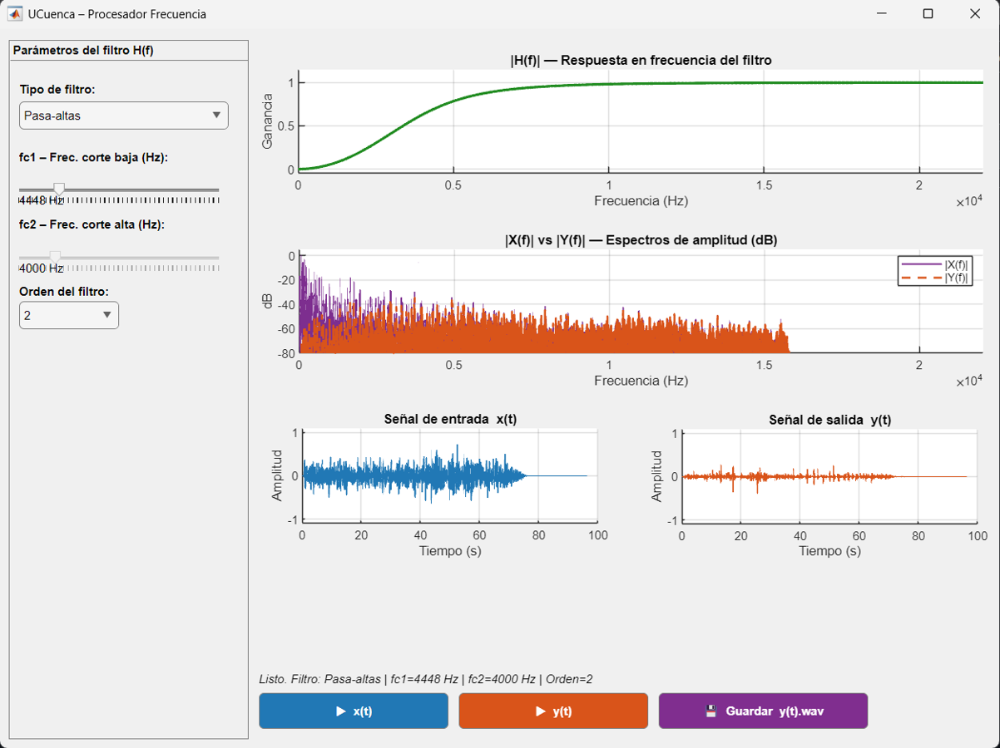

# FILTRADO-FOURIER-UCUENCA

Filtrado de señales en MATLAB usando la Transformada de Fourier

## Funcionamiento general

El proceso realizado es el siguiente:

1. Cargar una señal de audio en formato `.wav`.
2. Representar la señal en el dominio del tiempo.
3. Aplicar la Transformada de Fourier.
4. Analizar el espectro de frecuencias.
5. Eliminar componentes no deseadas mediante filtrado.
6. Reconstruir la señal usando la Transformada Inversa de Fourier.
7. Comparar el audio original con el audio filtrado.

## Imágen de la interfas gráfica

### Señal original

- [Escuchar audio original](señal%20limpia.wav)

### Señal con filtros

- [Audio con filtro pasa altas](y(t)_pasa-altas_fc1_750Hz.wav)
- [Audio con filtro pasa bajas](y(t)_pasa-bajas_fc1_750Hz.wav)
- [Audio con filtro pasa banda](y(t)_pasa-banda_fc1_750Hz_fc2_1500.wav)
- [Audio con filtro rechaza banda](y(t)_rechaza-banda_fc1_750Hz_fc2_1500.wav)
